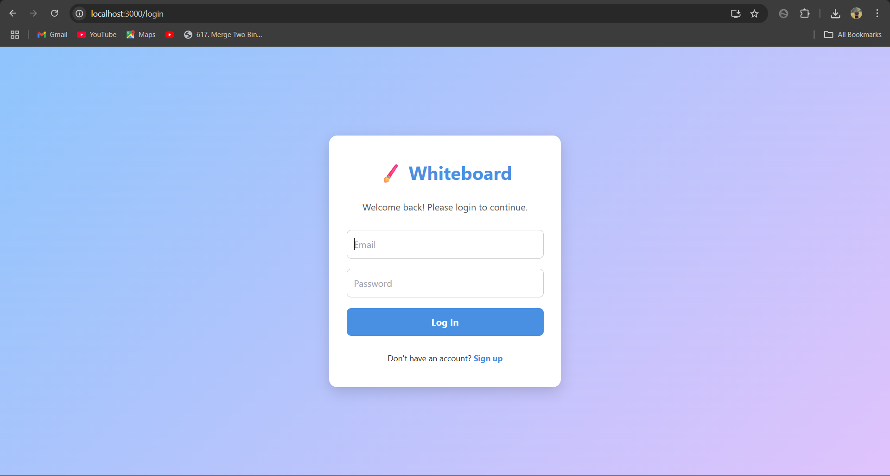
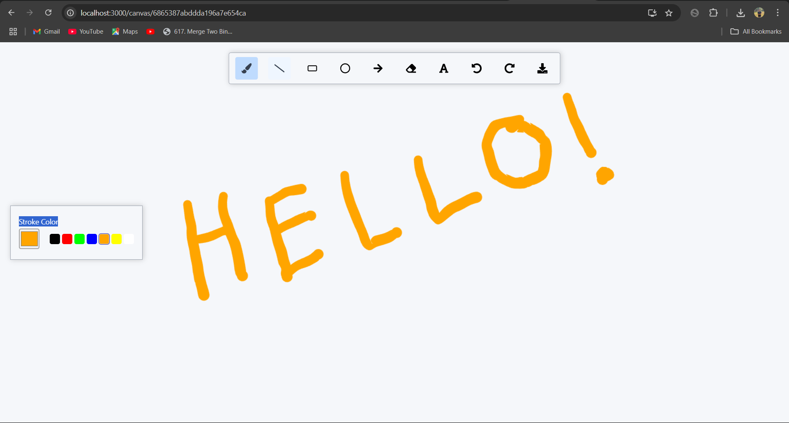
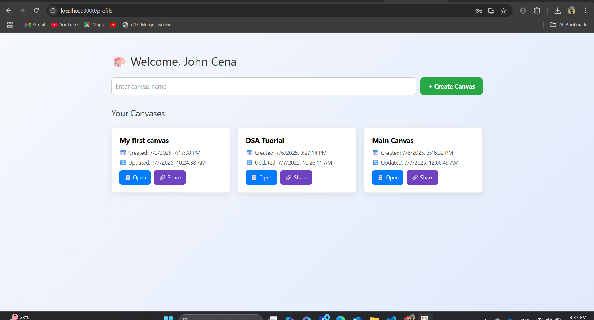

# Real-Time Collaborative Whiteboard

A real-time, collaborative whiteboard application that enables multiple users to draw, sketch, and share ideas visually on a shared canvas — all powered by **React**, **Node.js**, **MongoDB**, and **Socket.IO**.

> Built with real-time WebSocket communication, JWT authentication, RESTful APIs.

---

## Features

- **Collaborative Drawing**: Multiple users can draw on the same canvas simultaneously.
- **Canvas Sharing**: Share canvases with other registered users via email.
- **Real-time Sync**: Instant updates using **Socket.IO** with sub-second latency.
- **Authentication**: Secure login & signup with **JWT tokens**.
- **Canvas Storage**: Persistent canvas state saved in **MongoDB**.
- **RESTful APIs**: Robust endpoints for canvas CRUD operations.

---

## Screenshots

| Login Page | Whiteboard Canvas | Profile Dashboard |
|-------------|-------------------|-------------------|
|  |  |  |

---

##  Tech Stack

###  Frontend
- **React.js**
- **TailwindCSS**
- **ShadCN/UI**
- **React Router DOM**
- **Socket.IO Client**

###  Backend
- **Node.js** + **Express.js**
- **MongoDB** + **Mongoose**
- **Socket.IO**
- **JWT Authentication**


## Folder Structure

```
white-board/
├── client/           # React frontend
│   ├── pages/        # Routes: Signup, Profile, Canvas
│   ├── context/      # Board context (state management)
│   └── socket.js     # Socket.IO client setup
├── server/           # Express backend
│   ├── controllers/
│   ├── routes/
│   ├── models/
│   └── socket.js     # WebSocket server logic
```

##  Project Highlights 

- Developed a **real-time collaborative whiteboard** with React and Node.js, enabling multiple users to draw concurrently.

- Built secure **JWT-based authentication** and **MongoDB** persistence layer to manage user sessions and canvas data.

- Integrated **Socket.IO** for real-time communication with <100ms latency across shared sessions.

- Designed and optimized **RESTful APIs** for canvas management, improving response time by 30% with MongoDB indexing and lean querying.

---

## Acknowledgments

- Inspired by popular whiteboarding tools like **Excalidraw** and **Miro**
- Special thanks to open-source contributors and Socket.IO docs.

